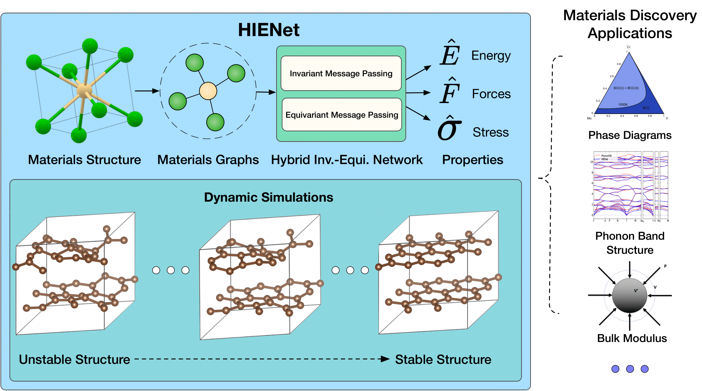

# HIENet

[A Materials Foundation Model via Hybrid Invariant-Equivariant Architectures](https://arxiv.org/abs/2503.05771)



## Abstract

HIENet is a machine learning interatomic potential for crystalline materials that predicts total energy, per-atom forces, and the stress tensor from a periodic crystal graph. Rather than committing to a fully invariant or fully equivariant design, it mixes the two: one invariant message-passing layer (graph-transformer style, gated attention over scalar features) is followed by three equivariant layers built from tensor products with spherical harmonics up to l = 3. The energy is read out from invariant scalars, and forces and stress are computed as position and strain derivatives of the energy, so force conservation, force equilibrium, and stress symmetry hold by construction. Trained on the Materials Project Trajectory dataset, HIENet reports state-of-the-art energy/force/stress MAE with higher inference throughput than fully equivariant models such as EquiformerV2 and SevenNet. This directory contains the PaddlePaddle implementation, ported from the official torch release and verified against it in fp64.

## Datasets

HIENet was trained on the Materials Project Trajectory (MPtrj) dataset; see the original [paper](https://arxiv.org/abs/2503.05771). No dataset is shipped with this repository: point the `path` entries in the `Dataset` section of `hienet_v3.yaml` to your own extxyz file of energy/force/stress-labeled structures (`frame_offset`/`num_frames` split that one file into train/val frames).

## Models

A crystal is converted to a periodic graph: nodes are atoms with one-hot species embeddings, and an edge j→i is created for every periodic image within the cutoff radius of 5.0 Å. Edge features are 8 radial Bessel basis functions damped by a polynomial envelope (p = 6):

$$
\bm{h}_{ji} = \frac{2\sin\left(\frac{n\pi}{R_{\text{cut}}}\|\bm{r}_{ji}\|_{2}\right)}{R_{\text{cut}}\|\bm{r}_{ji}\|_{2}} f_{\text{poly}}\left(\|\bm{r}_{ji}\|_{2}, R_{\text{cut}}\right).
$$

The hybrid stack then runs one invariant layer followed by three equivariant layers:

- The invariant layer updates scalar node features through gated attention, with key/query/value projections taken from concatenated node and edge features.
- Each equivariant layer carries node features as irreps `512x0e + 128x1e + 64x2e + 32x3e` and updates them with tensor products against spherical harmonics of the edge vectors (lmax = 3), followed by a gated skip connection.

The total energy is a sum of per-atom readouts of the invariant (l = 0) channels:

$$
E_{\text{tot}} = \sum_{i} \mathbf{W}_{e} \bm{f}_{i,0}.
$$

Forces and stress are derivative-based, which guarantees a conservative force field, zero net force in the absence of external influences, and a symmetric stress tensor:

$$
\mathbf{F}_i = -\frac{\partial E_{\text{tot}}}{\partial \mathbf{p}_i},
\qquad
\boldsymbol{\sigma}_{ij} = \frac{1}{V}\frac{\partial E_{\text{tot}}}{\partial \varepsilon_{ij}}.
$$

### Configuration constants

`_type_map`, `shift`, and `scale` in the `Model` section of `hienet_v3.yaml` are per-checkpoint constants carried by the released weights, not free hyperparameters: they are the concrete arrays the original training entry resolved at runtime from the symbolic entries of the upstream config:

- `chemical_species: auto` → the 89-species one-hot map,
- `shift: elemwise_reference_energies` → per-element energy references,
- `scale: forces_rms` → the normalization factor.

That entry script is not part of the AIRS original release, so the arrays stored in the released checkpoint are written out verbatim. Keep them unchanged when fine-tuning from or serving the released weights.

Retraining from scratch on a new dataset requires recomputing them from that dataset (species list, per-element reference energies, force RMS), and other same-architecture checkpoints come with their own values — swap the three entries together with the weights.

## Results

<table>
    <head>
        <tr>
            <th nowrap="nowrap">Model Name</th>
            <th nowrap="nowrap">Dataset</th>
            <th nowrap="nowrap">Energy MAE(meV/atom) / Force MAE(meV/Å) / Stress MAE(kBar)</th>
            <th nowrap="nowrap">Config</th>
        </tr>
    </head>
    <body>
        <tr>
            <td nowrap="nowrap">hienet_v3</td>
            <td nowrap="nowrap">MPtrj</td>
            <td nowrap="nowrap">6.77 / 24.82 / 2.31</td>
            <td nowrap="nowrap"><a href="hienet_v3.yaml">hienet_v3</a></td>
        </tr>
    </body>
</table>

**Note**: The model weights were converted from the [HIENet](https://github.com/divelab/AIRS) official torch implementation (the released checkpoint). We did not retrain the model on the full MPtrj dataset, so the MAE metrics in the table are cited from Table 2 of the original [paper](https://arxiv.org/abs/2503.05771) (validation split).

### Training

```bash
# multi-gpu training
python -m paddle.distributed.launch --gpus="0,1,2,3" interatomic_potentials/train.py -c interatomic_potentials/configs/hienet/hienet_v3.yaml
# single-gpu training
python interatomic_potentials/train.py -c interatomic_potentials/configs/hienet/hienet_v3.yaml
```

### Validation

```bash
# Adjust program behavior on-the-fly using command-line parameters, e.g. --Global.do_eval=True

python interatomic_potentials/train.py -c interatomic_potentials/configs/hienet/hienet_v3.yaml Global.do_eval=True Global.do_train=False Global.do_test=False Trainer.pretrained_model_path='your checkpoint path(*.pdparams)'
```

### Testing

```bash
# Evaluate the model's performance on the test dataset.

python interatomic_potentials/train.py -c interatomic_potentials/configs/hienet/hienet_v3.yaml Global.do_test=True Global.do_train=False Global.do_eval=False Trainer.pretrained_model_path='your checkpoint path(*.pdparams)'
```

### Prediction

```bash
# Predict energy, forces, and stress for new crystal structures.
# The prediction results will be saved in a CSV file specified by the save_path parameter. Default save_path is 'result.csv'.

# Mode 1: Leverage the registered pre-trained model. The implementation includes automated model download functionality, eliminating the need for manual configuration.
python interatomic_potentials/predict.py --model_name='hienet_v3' --input_format=cif --input_path='./interatomic_potentials/example_data/cifs/'

# Mode 2: Use a custom configuration file and checkpoint.
python interatomic_potentials/predict.py --config_path='interatomic_potentials/configs/hienet/hienet_v3.yaml' --checkpoint_path='./checkpoints/hienet_v3.pdparams' --input_format=cif --input_path='./interatomic_potentials/example_data/cifs/'
```

## Accuracy Alignment

Forward and training accuracy of the PaddlePaddle port were verified against the official torch implementation on a small pseudo-labeled validation set (Alexandria-derived structures labeled by the released weights). Three gates were run:

| Gate                 | Comparison                                                              | Result                                                       |
| :------------------- | :---------------------------------------------------------------------- | :----------------------------------------------------------- |
| forward, fp64        | Paddle vs torch, 21-structure set (20 evaluated under the ≤64-atom cap) | worst mean_abs: E 2.3e-13 / F 8.9e-15 / S 5.4e-16            |
| contract wrapper     | ppmat contract model vs the ported full-chain forward                   | max_abs: E 3.6e-15 / F 5.8e-15 / S 1.6e-16 (tolerance 1e-10) |
| training loss parity | 36 training steps (2 epochs × 18 steps), fp32 GPU                       | mean_rel across E/F/S/total: 2.1e-5 ~ 5.5e-5                 |

The workflow tests can be reproduced from the repository root:

```bash
python -m pytest test/test_hienet_cinn_workflows.py -v   # 6 passed, 1 skipped (GPU-gated tier)
```

Across all three gates, the differences between the torch and PaddlePaddle implementations are at floating-point noise level.

## CINN Acceleration

Training can be switched to compiled execution by setting `Execution.backend=cinn` in the config yaml. The backend takes effect through `paddle.jit.to_static(backend="CINN")` with `full_graph=False`, i.e. the SOT tier.

Steady-state training time per step (nvidia GPU, PaddlePaddle 3.4.0, batch 2, 40-frame subset, steady state = mean of epochs 2-5):

| Mode            | steady-state s/step | Speedup |
| :-------------- | :------------------ | :------ |
| eager (default) | 0.495               | —       |
| cinn (SOT)      | 0.479               | ~1.03x  |

Training losses stay finite and consistent across the two modes, as checked by the workflow test.

## Citation

```bibtex
@misc{yan2025materialsfoundationmodelhybrid,
      title={A Materials Foundation Model via Hybrid Invariant-Equivariant Architectures},
      author={Keqiang Yan and Montgomery Bohde and Andrii Kryvenko and Ziyu Xiang and Kaiji Zhao and Siya Zhu and Saagar Kolachina and Doğuhan Sarıtürk and Jianwen Xie and Raymundo Arroyave and Xiaoning Qian and Xiaofeng Qian and Shuiwang Ji},
      year={2025},
      eprint={2503.05771},
      archivePrefix={arXiv},
      primaryClass={cs.LG},
      url={https://arxiv.org/abs/2503.05771},
}
```
